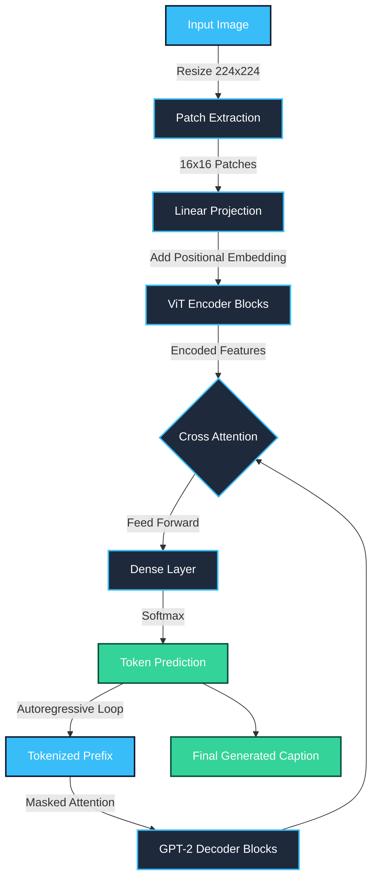

<div align="center">
  
  

  # 🧠 NeuralLens: Advanced Continual Learning Architecture
  
  **A state-of-the-art hybrid Vision-Transformer (ViT) & GPT-2 decoding engine featuring a bespoke, real-time glassmorphism web interface.**
  
  [](https://python.org)
  [](https://tensorflow.org)
  [](https://flask.palletsprojects.com/)
  [](https://github.com/psf/black)
  [](LICENSE)
  
  ---
  *NeuralLens bridges the gap between deep semantic image understanding and high-performance, edge-capable sequential text generation.*
</div>

<br>

## 🚀 Architectural Overview

NeuralLens is a highly scalable, real-time **Image Captioning Platform**. Moving beyond standard CNN-LSTM pipelines, NeuralLens utilizes a completely custom implementation of the **Transformer Architecture**. It features a continuous learning pipeline that allows fine-tuning directly via the web interface.

### ⚙️ The Pipeline
1. **ViT Image Encoder**: Images are fragmented into $16 \times 16$ patches, projected linearly, and infused with 1D positional embeddings. They are processed through 6 deep Multi-Head Self-Attention (MHSA) blocks to extract dense semantic features.
2. **GPT-2 Autoregressive Decoder**: A masked self-attention decoder utilizes Cross-Attention to query the ViT embeddings, predicting the next optimal token via a custom BPE (Byte-Pair Encoding) tokenizer.
3. **Flask Microservices Server**: The engine is securely wrapped in a multithreaded RESTful API, fully integrated with real-time hardware telemetry (`psutil` + `NVML`).

<br>

## 🧠 System Architecture



---

## ✨ Enterprise-Grade Features

| Feature | Description | Architecture Component |
| :--- | :--- | :--- |
| **Continual Learning** | Fine-tune the neural weights natively via drag-and-drop UI without catastrophic forgetting. | `tf.GradientTape()` Optimization |
| **BPE Tokenization** | Custom trained Byte-Pair Encoding merges subwords efficiently for precise multi-lingual support. | Subword Text Encoder |
| **Telemetry Dashboard** | Real-time tracking of CPU, RAM, and GPU memory allocation using interactive charts. | `psutil` + `Chart.js` |
| **Glassmorphism UI** | A fully animated, state-of-the-art dark mode interface with mouse-tracking hover glows. | Vanilla HTML5/CSS3/JS |
| **API Rate Limiting** | Generate admin-scoped API keys with set expiration dates for secure application integration. | JSON DB Interceptor |

---

## 💻 Local Deployment & Setup

This repository is optimized for both CPU and CUDA-enabled GPU execution environments.

### 1. Prerequisites & Installation
```bash
# Clone the repository
git clone https://github.com/Alouakhalid/NeuralLens.git
cd NeuralLens

# Install computational dependencies
pip install tensorflow keras flask flask-cors pillow psutil h5py numpy
```

### 2. Weight Configuration
Due to GitHub Large File Storage (LFS) limitations, the 1.3GB compiled weights (`.keras`) file is not pushed. 
- Ensure your `epoch_xx.keras`, `caption_tokenizer-vocab.json`, and `caption_tokenizer-merges.txt` files are located in the project root.

### 3. Server Initialization
```bash
python app.py
```
* **AI Studio UI**: Navigate to `http://localhost:5055`
* **Health Check**: Navigate to `http://localhost:5055/api/health`

---

## 🔌 API Reference Guide

NeuralLens securely exposes endpoints using X-API-Key headers. Keys can be dynamically generated inside the AI Studio.

<details>
<summary><b>🟢 1. Generate Image Caption</b></summary>

Perform high-speed inference using customizable sampling techniques.

* **Endpoint**: `/api/caption`
* **Method**: `POST`
* **Headers**: `X-API-Key: <your_token>`
* **Payload (multipart/form-data)**:
  - `image`: The JPEG/PNG file
  - `temperature`: (Optional) Float between 0.1 and 2.0 (Default: `1.0`)
  - `beam`: (Optional) Integer for Beam Search width (Default: `1`)

**cURL Example:**
```bash
curl -X POST http://localhost:5055/api/caption \
  -H "X-API-Key: nlk-xxxxxxxxxxxxxxxxx" \
  -F "image=@/path/to/test.jpg" \
  -F "temperature=0.8" \
  -F "beam=3"
```
</details>

<details>
<summary><b>🟢 2. Upload Training Sample</b></summary>

Add highly accurate ground-truth pairs directly into the unlearned dataset pool.

* **Endpoint**: `/api/train/upload`
* **Method**: `POST`
* **Payload (multipart/form-data)**:
  - `image`: The target image
  - `caption`: The text description

**cURL Example:**
```bash
curl -X POST http://localhost:5055/api/train/upload \
  -F "image=@/path/to/new_data.jpg" \
  -F "caption=A stunning visual of the milky way galaxy."
```
</details>

---

## 📂 Repository Structure

```text
NeuralLens/
├── app.py                      # Master Flask microservices & Model logic
├── index.html                  # Advanced Vanilla Canvas & Glassmorphism UI
├── .gitignore                  # Strict ignoring of weights & local databases
├── training_samples/           # Auto-generated directory for uploaded dataset
└── README.md                   # System architectural documentation
```

---

<div align="center">
  <b>Architected & Engineered by Khalid Ali</b><br>
  <i>AI Engineer & Deep Learning Researcher</i><br>
  <br>
  <a href="https://linkedin.com/in/alikhalidalikhalid"></a>
  <a href="https://github.com/Alouakhalid"></a>
</div>
